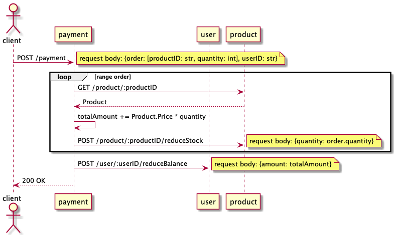

# PACT base App

PACT 検証用のベースアプリ

## 処理フロー



## 使い方

### PACT cli のインストール

mac の場合

```
brew tap pact-foundation/pact-ruby-standalone
brew install pact-ruby-standalone
```

### PACT の契約書ファイル作成

```
cd payment
go get
go test -v ./...
```

これで`pactfile/`ディレクトリに契約書ファイルが作成される

### provider 側の検証

```
cd product
pip install -r requirements.txt
./verify-pact.sh
```

`pactfile/`ディレクトリに契約書ファイルを読み込み後　
main で定義しているアプリ設定に setup 用のパスを付与したコードを起動する  
その後 pact の cli で検証を行なっている

Product のクラス定義などを変更すると pact の検証で失敗するようになる
